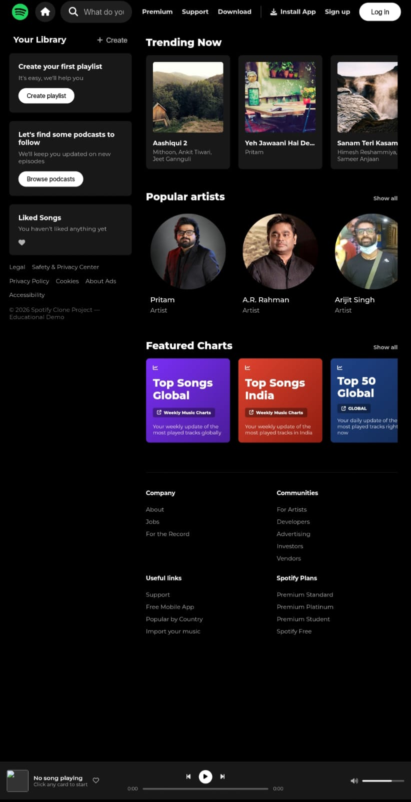

# 🎵 Spotify Clone

A responsive **Spotify Clone** built using **HTML, CSS, and JavaScript**. This project recreates the core layout and user interface of Spotify, including a navigation bar, music library, trending songs, popular artists, featured charts, and a functional music player.

## 🚀 Features

* 🎧 Spotify-inspired user interface
* 🔍 Search bar for music
* 🏠 Home navigation button
* 📚 Your Library section
* ➕ Create playlist option
* 🎙️ Browse podcasts option
* ❤️ Liked Songs section
* 🔥 Trending Now section
* 🎤 Popular Artists section
* 📊 Featured Charts section
* ⏪ Previous and next song controls
* ▶️ Play and pause functionality
* 🎵 Dynamic music player
* ⏱️ Song progress bar
* 🔊 Volume control
* ❤️ Like button for the currently playing song
* 🎨 Font Awesome icons
* 📱 Responsive layout

## 🛠️ Technologies Used

* **HTML5** – Structure of the website
* **CSS3** – Styling and responsive layout
* **JavaScript** – Music player, carousel, search, and interactive functionality
* **Font Awesome** – Icons
* **Google Fonts (Montserrat)** – Typography
* **HTML5 Audio API** – Audio playback

## 🔮 Future Improvements

The project can be improved further by adding:

* 🔐 User login and signup functionality
* 🔎 Fully functional music search
* 🎵 Dynamic song and artist pages
* ❤️ Persistent liked songs
* 📚 Create and manage custom playlists
* 🎙️ Podcast section
* ⏭️ Queue management
* 🔀 Shuffle and repeat controls
* 📱 Better mobile navigation
* 🌙 Improved responsive design for all screen sizes
* 🗄️ Backend and database integration
* 🌐 Music API integration
* 👤 User profiles
* 💳 Premium subscription simulation
* ⚡ Performance optimization
* 💾 Local storage for playlists and liked songs

## ⚠️ Disclaimer

This project is created **for educational and practice purposes only**.

It is a frontend clone inspired by Spotify and is **not affiliated with or endorsed by Spotify**. Spotify and its branding are trademarks of their respective owners.

## 👩‍💻 Author

**Janvi Chauhan**

If you found this project useful, feel free to ⭐ the repository!
